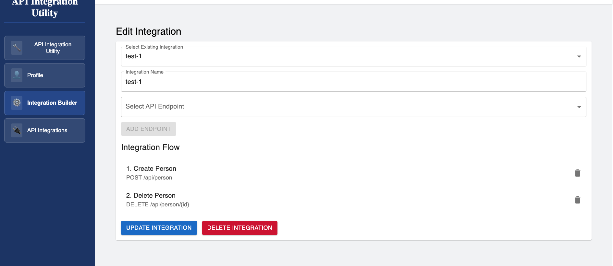

# API Integration Utility

A full-stack application for managing and testing API integrations, built with .NET Core and React.

## Features

- **User Authentication**
  - Secure login and registration
  - JWT-based authentication
  - Protected routes
  - Password validation (minimum 5 characters, uppercase, lowercase, number, special character)

- **API Management**
  - View and manage API endpoints
  - Test API endpoints directly from the UI
  - Real-time response display with status codes
  - Response time measurement
  - Detailed API information display

- **Database Integration**
  - PostgreSQL database
  - Entity Framework Core for data access
  - Automatic database migrations
  - Sample API endpoints pre-configured

## Tech Stack

### Backend
- .NET Core 9.0
- Entity Framework Core
- PostgreSQL
- JWT Authentication
- Swagger/OpenAPI

### Frontend
- React 18
- Material-UI (MUI)
- TypeScript
- Axios for API calls

## Getting Started

### Prerequisites
- Docker and Docker Compose
- .NET Core SDK 9.0
- Node.js 18+

### Installation

1. Clone the repository:
```bash
git clone <repository-url>
cd api-integration-utility
```

2. Start the application using Docker Compose:
```bash
docker compose up
```

The application will be available at:
- Frontend: http://localhost:3000
- Backend API: http://localhost:5001
- Swagger UI: http://localhost:5001/swagger

### Default Credentials
- Username: admin
- Password: admin123

## Project Structure

```
api-integration-utility/
├── backend/
│   ├── ApiIntegration.Api/          # Main API project
│   │   ├── Controllers/             # API endpoints
│   │   ├── Data/                    # Database context and migrations
│   │   ├── DTOs/                    # Data transfer objects
│   │   ├── Models/                  # Entity models
│   │   └── Program.cs               # Application entry point
│   └── Dockerfile                   # Backend container configuration
├── frontend/
│   ├── src/
│   │   ├── components/              # React components
│   │   ├── pages/                   # Page components
│   │   ├── services/                # API services
│   │   └── App.tsx                  # Main application component
│   └── Dockerfile                   # Frontend container configuration
└── docker-compose.yml               # Container orchestration
```

## API Endpoints

The application comes pre-configured with several API endpoints:

### People API
- GET /api/person - Get all people
- GET /api/person/{id} - Get person by ID
- POST /api/person - Create new person
- PUT /api/person/{id} - Update person
- DELETE /api/person/{id} - Delete person

### Products API
- GET /api/product - Get all products
- GET /api/product/{id} - Get product by ID
- POST /api/product - Create new product
- PUT /api/product/{id} - Update product
- DELETE /api/product/{id} - Delete product

## Application Flow

Here are some screenshots to illustrate the application flow:

1. **Register** - User registration page.
   

2. **Login** - User login page.
   

3. **Dashboard** - Main dashboard after login.
   

4. **Profile** - User profile page.
   

5. **Create Integration Builder** - Interface for creating new API integrations.
   

6. **Execute API Integration** - Page to execute API integrations.
   

7. **Execution Results API Integration** - Results of API integration execution.
   

8. **Update Integration Builder** - Interface for updating existing API integrations.
   

9. **Execution Results Updated API Integration** - Results of updated API integration execution.
   

10. **Delete Integration Builder** - Interface for deleting API integrations.
    

11. **Swagger** - Swagger UI for API documentation.
    

## Development

### Backend Development
```bash
cd backend/ApiIntegration.Api
dotnet run
```

### Frontend Development
```bash
cd frontend
npm install
npm start
```

### Database Migrations
```bash
cd backend/ApiIntegration.Api
dotnet ef migrations add <migration-name>
dotnet ef database update
```

## Contributing

1. Fork the repository
2. Create your feature branch (`git checkout -b feature/amazing-feature`)
3. Commit your changes (`git commit -m 'Add some amazing feature'`)
4. Push to the branch (`git push origin feature/amazing-feature`)
5. Open a Pull Request

## License

This project is licensed under the MIT License - see the LICENSE file for details. 